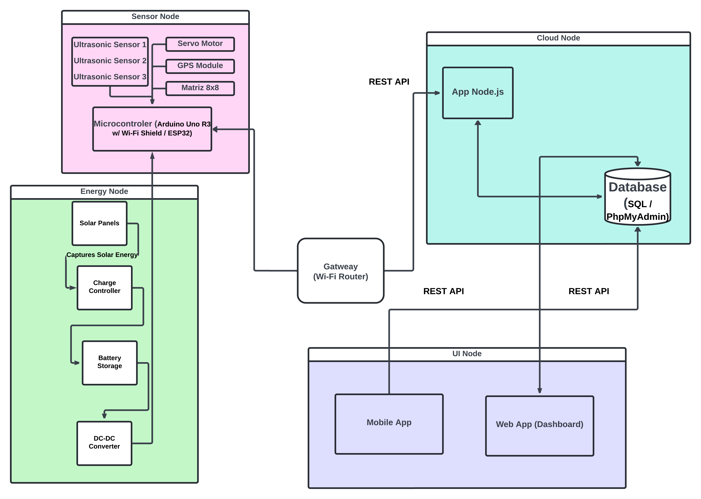
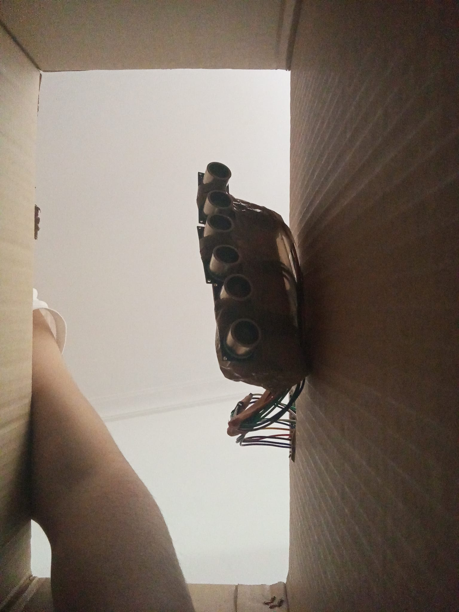
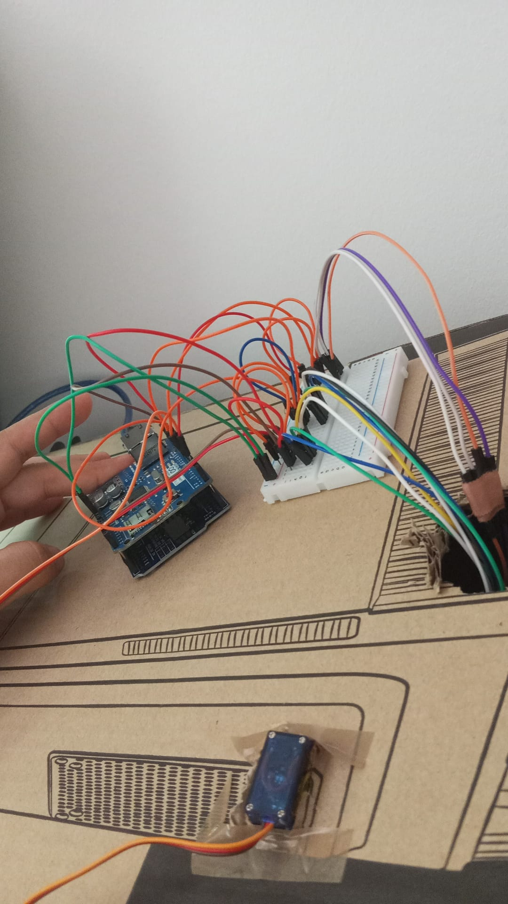
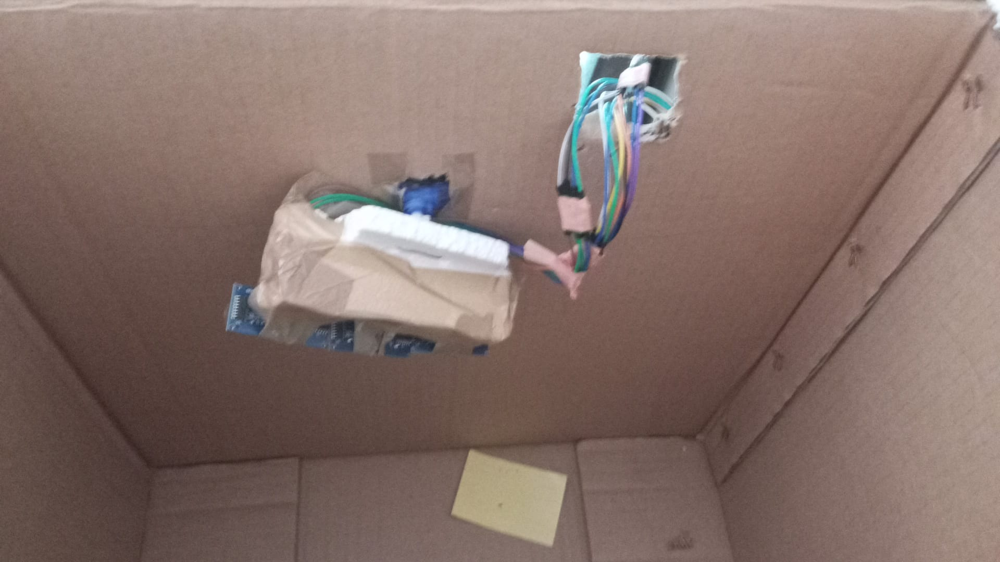
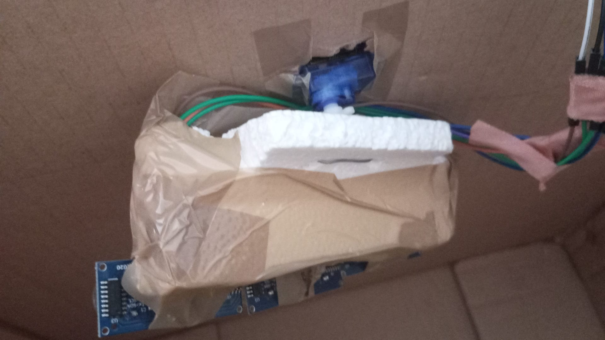
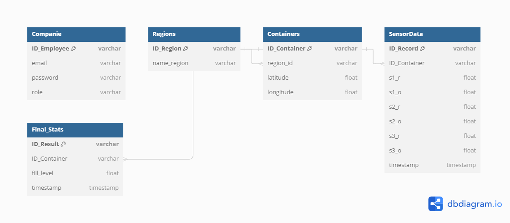
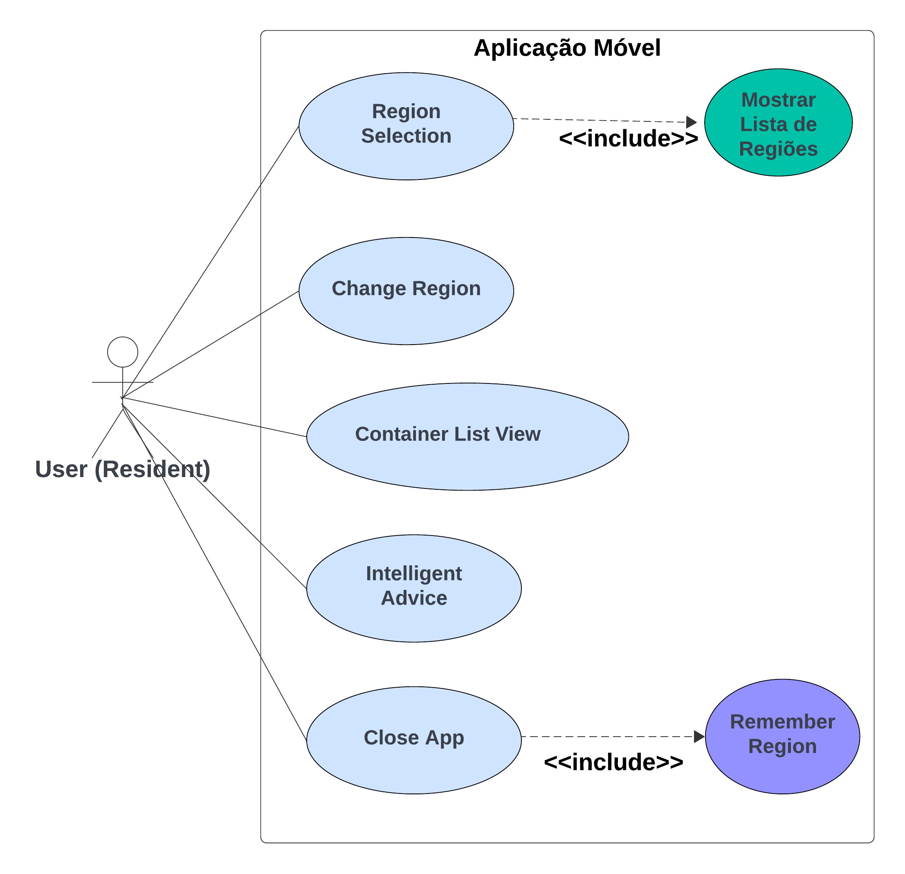
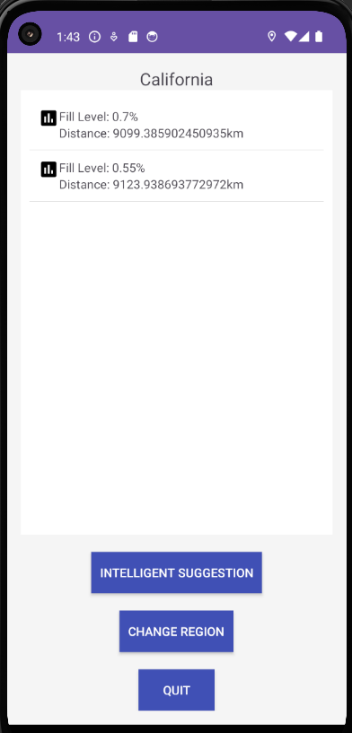

# Project Overview: Intelligent Waste Management System with IoT
---
### Problem 
Traditional waste management systems face several challenges, including:

1.  **Inefficient Collection Routes**: Waste collection trucks often follow fixed routes and schedules, leading to unnecessary trips to empty bins and missed collections for overflowing bins.
2.  **Lack of Real-Time Data**: Waste management companies lack real-time data on bin fill levels, leading to inefficient resource allocation.
3.  **Environmental Impact**: Inefficient waste collection increases fuel consumption and carbon emissions.
4.  **Operational Costs**: High operational costs due to inefficient routing and scheduling.
5.  **User Inconvenience**: Residents often find it difficult to locate nearby empty bins, leading to improper waste disposal.
6.  **Energy Consumption**: Waste bins require power for sensors and communication, which can be challenging to supply in remote areas.


### Proposed Solution: 
The Intelligent Waste Management System with IoT enhances traditional waste management by leveraging real-time sensor data and advanced software solutions to optimize operations. The system includes the following key components and user cases:

1.  **Real-Time Monitoring and Data Transmission**:
    -   **Use Case**: Sensors installed in waste bins monitor fill levels and transmit data to a central server.
    -   **Benefit**: Enables real-time tracking of bin status, reducing unnecessary collection trips and ensuring timely collection of full bins.
2.  **Optimized Collection Routes**:
    -   **Use Case**: The central server processes sensor data to dynamically optimize waste collection routes.
    -   **Benefit**: Reduces fuel consumption and operational costs by avoiding empty or nearly empty bins.
3.  **Mobile Application for Residents**:
    -   **Use Case**: Residents use a mobile app to locate nearby empty bins and receive intelligent disposal suggestions based on their location and bin fill levels.
    -   **Benefit**: Enhances user convenience and promotes proper waste disposal.
4.  **Web Dashboard for Waste Management Companies**:
    -   **Use Case**: Waste management companies access a web dashboard to view detailed information on bin fill levels, locations, and collection efficiency reports.
    -   **Benefit**: Facilitates better resource allocation and management, improving overall operational efficiency.
5.  **Sustainable Energy Use**:
    -   **Use Case**: Solar panels power the sensors and communication modules, with energy stored in batteries for use during low sunlight conditions.
    -   **Benefit**: Ensures reliable operation in remote areas and reduces the environmental impact of the system.


---
### Key Components:

1.  **Ultrasonic Sensors**: Installed in waste bins to measure the fill level. These sensors are also used to create a 3D representation of the waste inside the bin, providing a more accurate measure of the fill level.
2.  **Servo Motors**: Employed to enable the sweeping motion of the ultrasonic sensors for scanning the waste inside the bin. The servo motors help in obtaining 3D coordinates from different angles for mapping purposes.
3.  **Microcontroller (Arduino)**: Responsible for collecting and processing sensor data. It interfaces with the ultrasonic sensors and servo motors, and transfers the collected data to the server hosted on the virtual machine.
4.  **Virtual Machine (Ubuntu Desktop on Okeanos)**: This machine hosts the web server and the database. It retrieves the sensor data sent by the microcontroller, processes it (transforms the 3D coordinates to a 2D representation, calculates the fill level percentage), and stores the processed data in the SQL database.
5.  **GPS Module** (not implemented): Installed in each waste bin to track its location.
6.  **Connectivity**: Use of Wi-Fi to transmit data to the server on the virtual machine.
7.  **Web Server (Apache2)**: Hosts the web application and serves it to users.
8.  **Database (SQL/PhpMyAdmin)**: Stores and manages sensor data, user data, and other relevant information.
9.  **Solar Panels** (not implemented): Installed on or near the waste bins to capture solar energy.
10. **Charge Controller** (not implemented): Regulates the voltage and current coming from the solar panels.
11. **Battery Storage** (not implemented): Stores the energy generated by the solar panels for use when there's no sunlight.
12. **DC-DC Converter** (not implemented): Converts the battery voltage to the required voltage for the sensors, microcontroller, and GPS module.
13. **Matrix LED 8x8** (not implemented): Installed in each waste bin to display the fill level.
14. **Mobile Application for Residents**: Allows residents to locate nearby waste bins, view their fill level, and choose where to dispose of their waste based on occupancy. It also provides intelligent assistance by suggesting the best disposal option based on the user's location and the fill levels of nearby bins.
15. **Web Dashboard for Waste Management Companies**: Provides an overview of all waste bins under the company's responsibility, with detailed information on fill level, location, and collection efficiency reports. The company can manage the waste bins by adding, editing, or deleting bins. This dashboard is hosted on the Apache2 web server on the Okeanos virtual machine.
    
---
#### IoT System Architecture


---
### Pratical Setup 

| Bottom View | Cables View | Interior View | Top View |
|-------------|-------------|---------------|----------|
|  |  |  |  |


--------------------------------------------------------


#### Operation:

1.  Solar panels capture solar energy, which is regulated by the charge controller and stored in batteries.
2.  The DC-DC converter provides the required power to the ultrasonic sensors, microcontroller, GPS module, and Matrix LED 8x8.
3.  Ultrasonic sensors installed in waste bins measure the fill level and create a 3D representation of the waste inside the bin. They collect data in cylindrical coordinates, which are then sent to the Node.js server hosted on the virtual machine by the microcontroller via a REST API.
4.  Servo motors enable the sweeping motion of the ultrasonic sensors, exploring the waste within a 180° range and incrementing position by 15º each time.
5.  The microcontroller collects the data from the ultrasonic sensors and transfers it to the Node.js server on the virtual machine via a REST API.
6.  The Node.js server receives the sensor data, triggers a data processing script on the virtual machine which processes the real-world 3D coordinates, converts the scatter plot into a surface contour map of the scanned 3D environment inside the bin, calculates the fill level percentage, and registers this value in the SQL database.
7.  The Matrix LED 8x8 displays the fill level in different colors: Green for "Low", Yellow for "Moderate", and Red for "High".
8.  The mobile application enables residents to access real-time information and make informed waste disposal decisions based on the fill level data stored in the SQL database. It communicates with the Node.js server via a REST API to retrieve this data.
9.  Waste management companies use the web dashboard to monitor and optimize collection operations based on real-time sensor data and location information from the SQL database. The web dashboard communicates with the Node.js server via a REST API to retrieve, update, and delete this data.

#### Challenges:

1.  Ensuring the solar panels receive adequate sunlight and are properly maintained.
2.  Ensuring the accuracy and reliability of the 3D surface mapping technique using ultrasonic sensors and servo motors.
3.  Managing the battery storage to ensure there's enough power during periods of no sunlight.
4.  Ensuring the accuracy and reliability of ultrasonic sensors and GPS module.
5.  Developing intuitive user interfaces for the mobile application and web dashboard.
6.  Integrating the new system with existing waste management systems.
7.  Maintaining connectivity and performing adequate system maintenance over time.


----------------------------------------------------------

### BackEnd and FrontEnd Servers Hosted by VM

In this setup, we'll deploy a Node.js application along with a web server (Apache2) and PhpMyAdmin database on the same virtual machine (VM). This is a common configuration, especially when all these components are part of the same system.

#### Components:

1.  Node.js Application: This serves as the **backend server**, responsible for handling API requests, processing data, and interacting with the database.

2.  Web Server (Apache2): The web server serves static files and the **frontend** of our application. It acts as the interface between users' browsers and your Node.js backend.

3.  PhpMyAdmin Database: PhpMyAdmin provides a graphical interface to manage the MySQL database.

--------------------------------------------------------

### Database Design (Mobile App / Web App)



Trigger to calculate the fill level:

```
DELIMITER //
CREATE TRIGGER after_sensor_insert
AFTER INSERT ON SensorData
FOR EACH ROW
BEGIN
  DECLARE i INT DEFAULT 0;
  DECLARE r FLOAT;
  DECLARE pos FLOAT;
  DECLARE bin_height FLOAT DEFAULT 100; -- replace with your bin height
  DECLARE total_distance FLOAT DEFAULT 0;
  DECLARE fill_level FLOAT;
  DECLARE cur CURSOR FOR SELECT s1_r, s2_r, s3_r, position FROM SensorData WHERE ID_Container = NEW.ID_Container ORDER BY id DESC LIMIT 10;
  
  IF NEW.position = 180 THEN
    OPEN cur;
    FETCH cur INTO r, pos;
    WHILE i < 10 DO
      SET total_distance = total_distance + r;
      SET i = i + 1;
      FETCH cur INTO r, pos;
    END WHILE;
    CLOSE cur;
    SET fill_level = ((bin_height - (total_distance / i)) / bin_height) * 100;
    INSERT INTO final_stats (ID_Container, fill_level, timestamp) VALUES (NEW.ID_Container, fill_level, NOW());
  END IF;
END; //
DELIMITER ;
```

This MySQL trigger calculates the fill level of a waste bin each time new sensor data is added to the `SensorData` table. Here's a simplified explanation:

1.  **Trigger Activation**: The trigger activates when new sensor data is added. It only proceeds if the sensor has completed a full sweep of the bin (indicated by a `position` of `180`).

2.  **Data Retrieval**: The trigger fetches the last 10 distance measurements (`r`) from the `SensorData` table for the current bin (`ID_Container`).

3.  **Calculation**: The trigger calculates the average of these 10 measurements, then subtracts this from the total height of the bin to get the height of the waste. This is then converted to a percentage of the bin's total height to get the fill level.

4.  **Update Stats**: The calculated fill level, along with the bin ID and the current time, is added to the `final_stats` table for monitoring and analysis.

5.  **End**: If the sensor has not completed a full sweep, the trigger does nothing and waits for the next data to be added.

This process allows for real-time monitoring of the waste bin's fill level based on the sensor data.


---------------------------------------------------------


### Mobile Application

#### Requisites

1. **Region Selection**:
    - When the user opens the application for the first time, prompt the user to choose their current region from a list of available regions.

2. **Main Page**:
    - Upon selecting the region, the main page should display a list of containers in the chosen region.
    - Each container entry in the list should include:
        - The fill level percentage.
        - The distance between the container location and the user's current location.
    - Include a lamp icon on the main page to suggest the best disposal option based on the user's location and the fill levels of nearby bins.

3. **Change Region Option**:
    - In the main menu, include an icon or option to change the region to another one.
    - When selected, prompt the user to choose a different region from the available list.

4. **Remember Last Region**:
    - Implement functionality to remember the last selected region by saving it in the shared preferences (local storage on the device).
    - When the user closes the app and opens it again, automatically navigate the user to the last selected region, retrieved from the shared preferences.

<p align="center">
   
  
</p>

  
## Documentation

For a more detailed explanation, please refer to the [IoT_Project_Report.pdf](IoT_Project_Report.pdf).  
  
   
 

